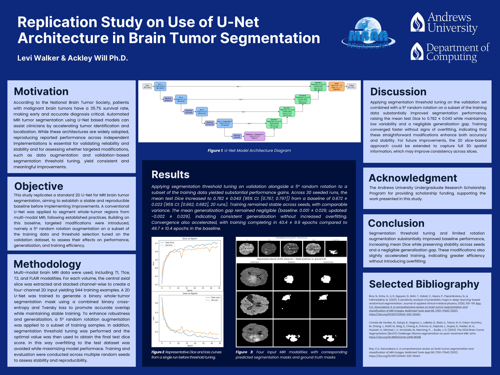
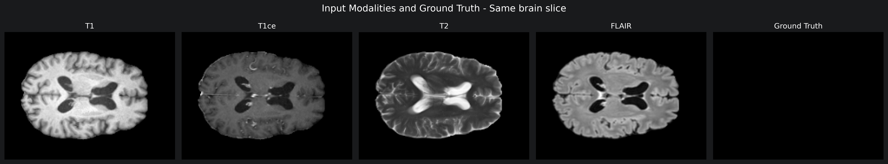
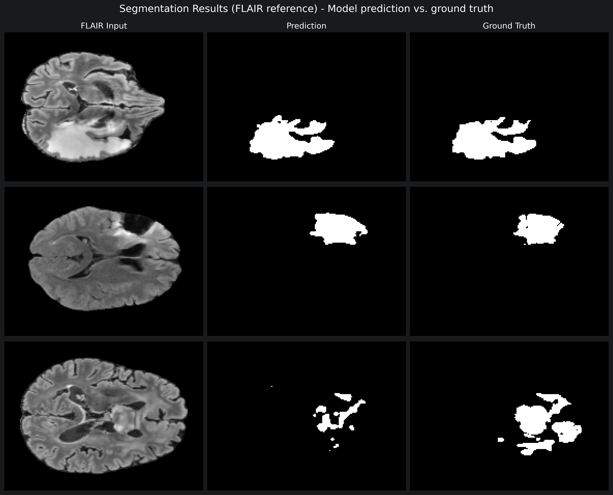

# BraTS 2024 U-Net Brain Tumor Segmentation

This repository contains my current work on brain tumor segmentation with a 2D U-Net. I am using the BraTS 2024 glioma dataset and combining four MRI modalities (T1, contrast-enhanced T1, T2, and FLAIR) to predict a binary whole-tumor mask.



## Project background

I first presented this project at MBAAI and have continued experimenting with it since then. The results saved here come from a newer experiment with 15 seeded runs. They are close to the results on the poster, but they do not match exactly because the notebook and analysis have changed as I have worked on the project. The poster shows where the study was at the time of the presentation; the notebook and CSV files show the current version.

My goal is to look at more than one successful training run. Changing the random seed affects the train, validation, and test split as well as model initialization, so running the model across several seeds gives a better picture of how stable the results are.

## Approach

For each subject, I use the central axial slice from the four aligned MRI volumes. The four slices are stacked into one input and resized to 144 x 192 pixels. All tumor labels in the segmentation mask are combined into one whole-tumor class.

The model is a four-level 2D U-Net. Training uses a combination of binary cross-entropy and Tversky loss, with more weight placed on missed tumor pixels. I use an approximately 70/15/15 train, validation, and test split. Early stopping monitors validation Dice and restores the best weights from each run.

The model produces a probability map, so I also test a range of thresholds. The threshold is selected using only the validation set and is then fixed before evaluating the test set. Flip and rotation augmentation are included in the notebook, but both were disabled for this experiment after they did not improve validation performance.

## Current results

Across the 15 seeded runs, the mean validation-tuned test Dice score was **0.773**. The mean validation Dice score was **0.777**, and training stopped after an average of **39.7 epochs**.

The full results are saved in:

- [`results/multiseed_results.csv`](results/multiseed_results.csv)
- [`results/multiseed_results_report.csv`](results/multiseed_results_report.csv)

### Example inputs and predictions





## Running the notebook

The Conda environment can be created with:

```bash
conda env create -f tf-brain.yml
conda activate tf-brain
jupyter lab
```

Then open [`brain-tumor-unet-replication.ipynb`](brain-tumor-unet-replication.ipynb) and run the cells in order.

The BraTS data must be downloaded separately and placed in this directory:

```text
BraTS2024-BraTS-GLI-TrainingData/
`-- training_data1_v2/
    `-- BraTS-GLI-.../
        |-- ...-t1n.nii.gz
        |-- ...-t1c.nii.gz
        |-- ...-t2w.nii.gz
        |-- ...-t2f.nii.gz
        `-- ...-seg.nii.gz
```

The notebook writes aggregate CSV files to `results/`, model checkpoints to `results/checkpoints/`, training histories to `results/history/`, and figures to `results/research_images/`.

## Limitations

This is a 2D study using one slice per subject, so it does not use the full spatial information available in each MRI volume. It also combines all tumor regions into one class instead of evaluating separate tumor subregions. The work is experimental and is not intended for clinical use.

## References

- Bice, N. et al. (2021). *A sensitivity analysis of probability maps in deep-learning-based anatomical segmentation*. Journal of Applied Clinical Medical Physics, 22(8), 105-119. https://doi.org/10.1002/acm2.13331
- BraTS 2024 challenge dataset paper: https://doi.org/10.48550/arXiv.2405.18368

## Acknowledgment

Research advisor: Dr. Ackley Will  
Andrews University Computer Science Department

## License

The code and original documentation in this repository are available under the [MIT License](LICENSE). The BraTS dataset and other third-party materials keep their original terms.
